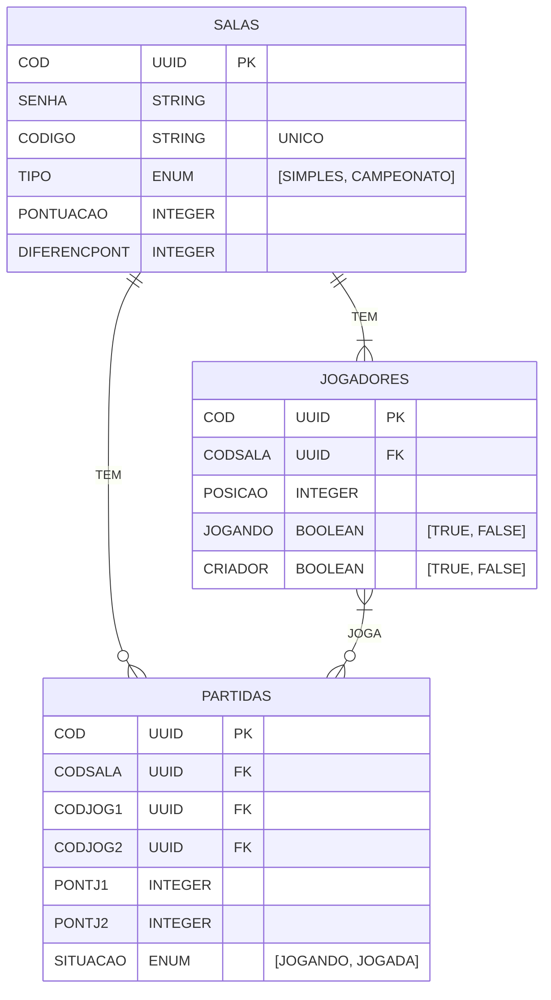

# Placar Pingas

## Modelagem do Banco


Version: 1.0.0


## Configuração do Ambiente

1. Clone este repositório em sua máquina usando o seguinte comando:

```bash
git clone https://github.com/israelrodrigues01/placar-pingas.git
```

2. Entre no repositorio clonado

```bash
cd placar-pingas/
```

3. Crie o arquivo .env

```bash
cp .env.example .env
```

4. Gere a chave de criptografia do Laravel:

```bash
php artisan key:generate
```

5. Crie um link simbólico para o armazenamento público:

```bash
php artisan storage:link
```

6. Modifique no arquivo .env o nome do APP_NAME:

```bash
"Placar Pingas"
```

7. No arquivo .env faça sua conexão MySql e insira:

```bash
DB_DATABASE=placar_pingas
```

8. Rode as migrations do sistema:

```bash
php artisan migrate
```

9. Rode todas as seeders do projeto:

```bash
php artisan db:seed
```

10. Se tiver rodado o código 8 e 9, caso não tiverem rodando, execute novamente as migrations e logo após as seerders:

```bash
php artisan migrate:fresh --seed
```

11. Caso algum dos códigos a cima derem erro, execute as migrations junto com as seeders:

```bash
php artisan migrate:refresh --seed
```
